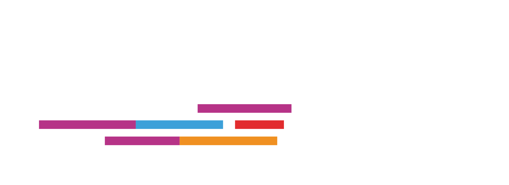

<p align="center">
  
</p>

# CodamHero v2
CodamHero v2 gives staff and students an overview of everything Codam.

## Limited access
Only staff members or C.A.T.s have access to (parts of) piscine overviews by design.

## Prerequisites
- Node.js (`brew install node` if you are on Mac, otherwise you gotta figure it out)
- A 42 API key (get one from your intra: Settings > Applications > Register a new app)
	- URI key must be localhost:4000 or 5000 according to your build
	- Make sure the scope is accurate

## Setup
**Install dependencies:**
```bash
npm install
```

**Setup your keys:**
```bash
cp .env.example .env
nano .env
```
- Add your INTRA_UID and INTRA_SECRET
- Add a SESSION_SECRET and DIRECT_AUTH_SECRET


## Development
**Run the following:**
```bash
npm run build
npx prisma migrate deploy
npm run start
```

**To migrate the database, run:**
```bash
npx prisma migrate dev --name "<migration-name>"
```

### Notes
**Don't push your API key.** 
